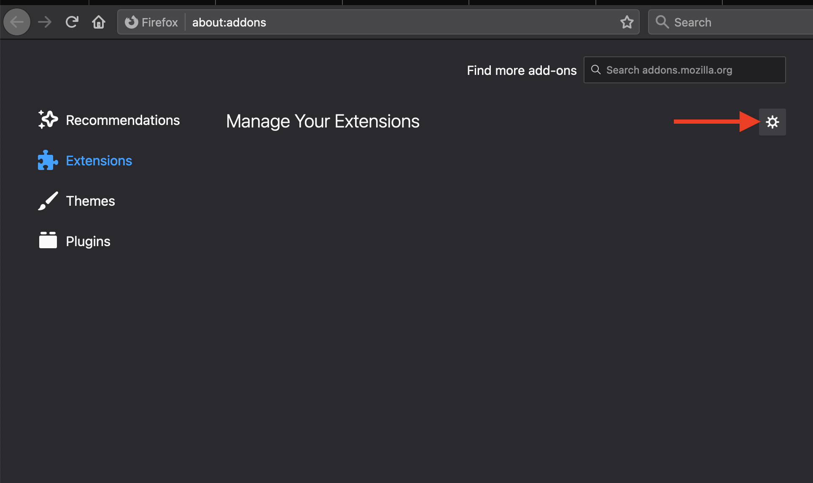

# TG-Octopus Clipboard Extension

(Only for Firefox browsers)

This extension allows to read clipboard data from app code.
The reason for this is that firefox only allows access to the clipboard data from the browser extensions (https://developer.mozilla.org/en-US/docs/Web/API/Clipboard/readText#browser_compatibility)

## For users

This extension can only be installed locally.

1. Download and save [this installer file](https://github.com/PlayQ/tg-octopus-clipboard-extension/raw/main/web-ext-artifacts/tg_octopus_clibpoard-1.0-an%2Bfx.xpi) on your computer.
2. Go to Settings (☰) > Add-ons. This page will display any installed extensions. From here you can update, remove, or search for new extensions and add-ons.

   > This page can also be accessed by typing “about:addons” into the address bar.

   

3. From the add-ons interface, press Settings (gear icon) next to the add-on search bar. This will open a menu of add-on specific controls.
   
4. Select “Install Add-on from File…” from the menu. This will bring up a file explorer window.
   
5. Browse to the .xpi file and press Open. A notification will appear to the left of the address bar that an external source wants to install an add on.
   
6. Verify installation. Press “Install” in the notification and restart Firefox if necessary.
   

## For developres

A full description of how to build and sign an extension can be found here:
https://extensionworkshop.com/documentation/develop/getting-started-with-web-ext/
